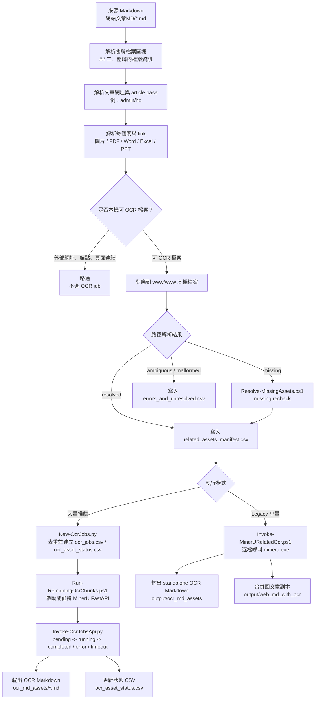

# MinerU related-asset OCR pipeline

This workspace scans `網站文章MD`, finds local related images/files from the `## 二、關聯的檔案資訊` section, resolves them against `www/www`, and OCRs supported assets with MinerU. Bulk runs produce standalone OCR Markdown plus resumable status CSVs; the legacy integrated flow can also write augmented Markdown copies to `output/web_md_with_ocr`.

## 2026-06 platform handoff

The platform run finished OCR and produced inline merged Markdown. The maintainable handoff files are:

- `docs/OCR_PIPELINE_USAGE.md`: production script usage from scan/job creation through OCR, inline merge, and final report generation.
- `docs/MINERU_MODEL_ARCHITECTURE.md`: MinerU runtime and model pipeline architecture observed on the H200 platform.
- `scripts/Merge-OcrMarkdownIntoWebMd.py`: bulk merge script; use `--placement inline` to put OCR blocks under each related-file item.
- `scripts/Build-FinalReport.py`: final reporting script.
- `reports/final_report_20260615/FINAL_REPORT.md`: final scan/OCR/merge report plus CSV appendices.

Final remote output path:

```text
/mnt/project/output/web_md_with_ocr_inline_20260615
```

## OCR pipeline 總覽

這個 workspace 的 OCR pipeline 分成兩條路線：

- **大量 OCR 推薦路線**：先掃描出可 OCR 的關聯檔案，建立 `ocr_asset_status.csv`，再用長駐 MinerU FastAPI server 分 chunk 跑 OCR。這條路線避免每個檔案都重新啟動 MinerU，適合 1000 / 10000 筆以上。
- **Legacy 小量整合路線**：用 `Invoke-MinerURelatedOcr.ps1` 一次完成掃描、單檔 `mineru.exe` OCR、合併 Markdown。適合小量測試，不適合大量處理。



### Pipeline 階段說明

1. **掃描 Markdown**

   `Invoke-MinerURelatedOcr.ps1` 會遞迴掃描 `網站文章MD` 下的 `.md` 檔案，讀取每篇文章的 `## 二、關聯的檔案資訊` 區塊，並從文章內的 `文章網址` 推出相對路徑基準，例如 `https://www.yzu.edu.tw/admin/ho/index.php/...` 會得到 `admin/ho`。

2. **解析與過濾關聯檔案**

   每個關聯項目會先判斷是不是外部網址、錨點、頁面連結或非檔案引用；這些不會進入 OCR。可處理的檔案類型包含圖片與常見文件格式，例如 `.jpg`、`.png`、`.pdf`、`.docx`、`.xlsx`、`.pptx`。

3. **對應本機檔案**

   本機路徑解析順序是：

   1. 同網域絕對 URL：`https://www.yzu.edu.tw/admin/ho/files/a.pdf` 對應到 `www/www/admin/ho/files/a.pdf`。
   2. 相對路徑：`files/a.pdf` 會用文章的 article base 補成 `www/www/<article-base>/files/a.pdf`。
   3. 直接路徑不存在時，會在 `www/www` 下做唯一 suffix 搜尋；只有唯一命中才接受。
   4. 初次掃描仍 missing 的項目，預設會再交給 `Resolve-MissingAssets.ps1` 做 missing recheck。

   最終結果會寫入 `output/manifest/related_assets_manifest.csv`。無法安全解析的項目會保留在 manifest，並另外輸出到 `errors_and_unresolved.csv` 方便人工檢查。

4. **建立大量 OCR job**

   大量 OCR 不直接從 Markdown 逐篇跑。先用 `New-OcrJobs.py` 讀取 `related_assets_manifest.csv`，把同一個 `resolvedRelativePath` 去重成唯一 asset，建立：

   - `ocr_jobs.csv`：本次可跑的 job 清單。
   - `ocr_asset_status.csv`：可續跑的主狀態表。

   如果有既有 OCR inventory，同一個 asset 會標成 `completed_cached`，不會重跑。

5. **執行 MinerU OCR**

   大量路線使用 `Run-RemainingOcrChunks.ps1` 管理 chunk。它會先啟動一個長駐 MinerU FastAPI server，然後每個 chunk 呼叫 `Invoke-OcrJobsApi.py`：

   - 從 `ocr_asset_status.csv` 選出 `pending` rows。
   - 寫回 `running`，避免中途狀態不明。
   - 以 `batch-size 16`、`concurrency 3` 送到 MinerU API。
   - 下載 MinerU result zip，解壓到 `mineru_raw`。
   - 挑出產生的 `.md`，複製到 `ocr_md_assets`。
   - 寫回 `completed`、`error` 或 `timeout`，並記錄 `ocrMarkdownPath`、`ocrChars`、`ocrDurationSec`、`lastError`。

   這個設計的重點是：正常情況下只維持一個 MinerU API，不會每個檔案重新啟動 `mineru.exe`。只有 chunk timeout、runner 失敗或 API health check 失敗時，driver 才會重啟 API。

6. **合併 Markdown**

   Legacy 小量路線會在 OCR 成功後，把原始 Markdown 複製到 `output/web_md_with_ocr`，並在文末追加：

   ```markdown
   ## 三、關聯檔案 OCR Markdown
   ```

   每個 OCR 區塊會記錄關聯類型、本機檔案、OCR Markdown 路徑、字數與驗證狀態。若 OCR Markdown 超過 `LargeMarkdownChars`，預設只標記為 oversized，不直接內嵌全文；完整內容仍保留在 `output/ocr_md_assets`。

## Setup MinerU

```powershell
pwsh -ExecutionPolicy Bypass -File .\scripts\Setup-MinerU.ps1
.\.venv\Scripts\Activate.ps1
```

## Scan only

Use this first to verify which related assets can be resolved without running OCR:

```powershell
pwsh -ExecutionPolicy Bypass -File .\scripts\Invoke-MinerURelatedOcr.ps1 -SkipOcr
```

The scan now automatically runs the missing-asset recheck and merges those results back into
`output/manifest/related_assets_manifest.csv`. The initial conservative scan is preserved as
`output/manifest/related_assets_manifest.initial.csv`.

To skip the automatic missing recheck:

```powershell
pwsh -ExecutionPolicy Bypass -File .\scripts\Invoke-MinerURelatedOcr.ps1 -SkipOcr -SkipMissingRecheck
```

To also check whether each Markdown article URL is still reachable online:

```powershell
pwsh -ExecutionPolicy Bypass -File .\scripts\Invoke-MinerURelatedOcr.ps1 -SkipOcr -CheckArticleUrl -ArticleUrlTimeoutSec 10
```

This writes `output/manifest/article_url_status.csv`. A `article_404` status means the live article page returned HTTP 404; it does not by itself prove that related local files are missing from `www/www`.

## Fast GPU OCR runbook for bulk jobs

大量 OCR 請用這一段，不要用下面舊的單檔 `mineru.exe` 流程。目標是固定用一個長駐 MinerU FastAPI server，讓每個 chunk 只送任務，不重新啟動整個 MinerU pipeline。

目前驗證過的主輸出資料夾：

```text
D:\Programming\web_ocr2md\mineru_ocr_workspace\output_update_md_ocr_jobs_api_batch16_gpu_remaining_all_v5_chunked
```

目前驗證過的主狀態 CSV：

```text
D:\Programming\web_ocr2md\mineru_ocr_workspace\output_update_md_ocr_jobs_api_batch16_gpu_remaining_all_v5_chunked\ocr_asset_status.csv
```

### 1. 啟動前檢查

在 PowerShell 7 開啟，先切到 repo 根目錄：

```powershell
Set-Location 'D:\Programming\web_ocr2md'
```

確認 GPU runtime 是 CUDA，不是 CPU：

```powershell
& 'D:\Programming\web_ocr2md\mineru_ocr_workspace\.venv\Scripts\python.exe' -c "import torch; print('cuda_available=', torch.cuda.is_available()); print('device=', torch.cuda.get_device_name(0) if torch.cuda.is_available() else 'CPU only')"
nvidia-smi
```

正常條件：

- `cuda_available= True`
- `device=` 顯示 RTX 4080 或目前可用的 NVIDIA GPU
- `nvidia-smi` 看得到 Python/MinerU process 在跑時吃 GPU

不要在 OCR 執行時用 Excel 開著 `ocr_asset_status.csv`，否則 CSV 可能被鎖住，造成狀態寫入錯誤或速度異常。

如果之前有中斷過，先檢查是否有殘留 OCR worker：

```powershell
Get-CimInstance Win32_Process |
  Where-Object {
    $_.CommandLine -like '*D:\Programming\web_ocr2md\mineru_ocr_workspace*' -and
    $_.CommandLine -match 'mineru\.cli\.fast_api|Invoke-OcrJobsApi\.py|Run-RemainingOcrChunks\.ps1'
  } |
  Select-Object ProcessId,Name,CommandLine
```

如果確認是殘留 OCR worker，再停止它們：

```powershell
$targets = Get-CimInstance Win32_Process |
  Where-Object {
    $_.CommandLine -like '*D:\Programming\web_ocr2md\mineru_ocr_workspace*' -and
    $_.CommandLine -match 'mineru\.cli\.fast_api|Invoke-OcrJobsApi\.py|Run-RemainingOcrChunks\.ps1'
  }
$targets | ForEach-Object { Stop-Process -Id $_.ProcessId -Force }
```

### 2. 先跑 50 筆速度測試

第一次啟動或改過環境後，先跑一個 chunk。這會用 `Batch 16 + concurrency 3`，但只取 50 筆 pending rows 測速：

```powershell
& 'D:\Programming\web_ocr2md\mineru_ocr_workspace\scripts\Run-RemainingOcrChunks.ps1' `
  -JobsCsv 'D:\Programming\web_ocr2md\mineru_ocr_workspace\output_update_md_ocr_jobs_api_batch16_gpu_remaining_all_v5_chunked\ocr_asset_status.csv' `
  -OutDir 'D:\Programming\web_ocr2md\mineru_ocr_workspace\output_update_md_ocr_jobs_api_batch16_gpu_remaining_all_v5_chunked' `
  -ChunkLimit 50 `
  -MaxChunks 1 `
  -ChunkTimeoutSec 1800 `
  -MaxStaleRunningAttempts 1 `
  -UsePersistentApi $true `
  -ApiMaxConcurrentRequests 3
```

`ChunkLimit 50` 是每輪取 50 個 status rows，不是 OCR batch size。實際 OCR runner 內部固定使用：

- `--batch-size 16`
- `--concurrency 3`
- `--skip-error-retry`
- `--skip-timeout-retry`

已經是 `completed` / `completed_cached` 的檔案會跳過，不會重複 OCR。`timeout` 和 `error` 也會在主流程跳過，避免卡住整批；之後要另外用低並行單獨處理。

### 3. 正常速度基準

2026-06-11 實測，50 個約 256 KB 左右的小 PDF：

- API runner elapsed: `163.14 sec`
- chunk wall time: `177.28 sec`
- runner 平均: `3.26 sec/file`
- chunk 平均: `3.55 sec/file`
- 結果: `50 success / 0 error / 0 timeout`

所以同類型小 PDF 的正常範圍大約是 `3-5 sec/file`。如果後面 pending 檔案變成大 PDF、DOCX、XLSX、PPTX，速度會比這個慢；這是檔案大小與格式問題，不一定是指令退回慢速模式。

這套流程能保證的是「沒有回到每檔重啟 MinerU pipeline」：

- `Run-RemainingOcrChunks.ps1` 先啟動一個 persistent MinerU API
- 每個 chunk 呼叫 `Invoke-OcrJobsApi.py --api-url <url>` 送任務
- 只有 chunk timeout 時才重啟 API
- 不是每個檔案重啟，也不是正常情況下每個 chunk 重啟

### 4. 正式繼續跑剩餘 OCR

50 筆測試正常後，再跑正式續跑：

```powershell
& 'D:\Programming\web_ocr2md\mineru_ocr_workspace\scripts\Run-RemainingOcrChunks.ps1' `
  -JobsCsv 'D:\Programming\web_ocr2md\mineru_ocr_workspace\output_update_md_ocr_jobs_api_batch16_gpu_remaining_all_v5_chunked\ocr_asset_status.csv' `
  -OutDir 'D:\Programming\web_ocr2md\mineru_ocr_workspace\output_update_md_ocr_jobs_api_batch16_gpu_remaining_all_v5_chunked' `
  -ChunkLimit 50 `
  -MaxChunks 500 `
  -ChunkTimeoutSec 1800 `
  -MaxStaleRunningAttempts 1 `
  -UsePersistentApi $true `
  -ApiMaxConcurrentRequests 3
```

如果要限制本次只跑約 1000 筆，把 `-MaxChunks 500` 改成 `-MaxChunks 20`。因為 `ChunkLimit 50 * MaxChunks 20 = 1000`。

### 5. 監控進度

看 chunk driver log：

```powershell
Get-Content 'D:\Programming\web_ocr2md\mineru_ocr_workspace\output_update_md_ocr_jobs_api_batch16_gpu_remaining_all_v5_chunked\ocr_gpu_remaining_v5_chunk_progress.log' -Tail 40 -Wait
```

看 status 分布：

```powershell
Import-Csv 'D:\Programming\web_ocr2md\mineru_ocr_workspace\output_update_md_ocr_jobs_api_batch16_gpu_remaining_all_v5_chunked\ocr_asset_status.csv' |
  Group-Object ocrStatus |
  Select-Object Name,Count
```

正常現象：

- 每個 chunk 前後 pending 會下降，通常每輪下降接近 50
- log 會出現 `persistent MinerU API healthy`
- log 會出現 `after chunk=<n> exit=0 elapsedSec=<seconds>`
- chunk 結束後不應長期留下 `running`

異常現象：

- 多個 chunk 接近 `1800 sec` timeout
- pending 沒有下降，卻一直耗時
- `zero-progress chunks` 增加
- GPU 滿載但 CSV 狀態長時間不變

`zero-progress chunk` 的意思是：chunk 確實跑了一段時間，但下一輪 pending 數沒有下降。它通常代表某批任務卡住、CSV 寫入失敗、API/worker stale，或該 chunk 全部都被卡住檔案占用。它不是一種檔案狀態，而是進度診斷指標。

### 6. 跑完或異常後產生速度報告

```powershell
& 'D:\Programming\web_ocr2md\mineru_ocr_workspace\.venv\Scripts\python.exe' `
  'D:\Programming\web_ocr2md\mineru_ocr_workspace\scripts\Analyze-OcrPerformance.py' `
  --status-csv 'D:\Programming\web_ocr2md\mineru_ocr_workspace\output_update_md_ocr_jobs_api_batch16_gpu_remaining_all_v5_chunked\ocr_asset_status.csv' `
  --progress-log 'D:\Programming\web_ocr2md\mineru_ocr_workspace\output_update_md_ocr_jobs_api_batch16_gpu_remaining_all_v5_chunked\ocr_gpu_remaining_v5_chunk_progress.log' `
  --out-json 'D:\Programming\web_ocr2md\mineru_ocr_workspace\output_update_md_ocr_jobs_api_batch16_gpu_remaining_all_v5_chunked\OCR_PERFORMANCE_REPORT.json' `
  --out-md 'D:\Programming\web_ocr2md\mineru_ocr_workspace\output_update_md_ocr_jobs_api_batch16_gpu_remaining_all_v5_chunked\OCR_PERFORMANCE_REPORT.md'
```

速度報告重點看：

- `avgWallSecPerAdvancedFile`
- `zeroProgressChunkCount`
- `zeroProgressElapsedSec`
- `sizeByStatus.pending`
- `slowestChunks`

如果 `zeroProgressChunkCount > 0`，先暫停並清理殘留 worker，不要把 `timeout` rows 直接丟回主流程重跑。那些檔案應該另開低並行或單檔模式處理。

### 7. 成功輸出確認

`ocr_asset_status.csv` 是總集合與 resume 依據。每一筆成功 OCR 的 row 應該至少有：

- `ocrStatus` = `completed` 或 `completed_cached`
- `ocrMarkdownPath` 指向存在的 `.md`
- `ocrDurationSec` 有本次或先前 OCR 耗時

跑完後用這段檢查是否有「狀態完成但 markdown 不存在」：

```powershell
$csvPath = 'D:\Programming\web_ocr2md\mineru_ocr_workspace\output_update_md_ocr_jobs_api_batch16_gpu_remaining_all_v5_chunked\ocr_asset_status.csv'
$rows = Import-Csv $csvPath
$done = $rows | Where-Object { $_.ocrStatus -like 'completed*' }
$missingMarkdown = $done | Where-Object {
  -not $_.ocrMarkdownPath -or -not (Test-Path -LiteralPath $_.ocrMarkdownPath)
}
"completed rows: $($done.Count)"
"completed rows missing markdown: $($missingMarkdown.Count)"
$missingMarkdown | Select-Object -First 20 assetId,sourcePath,ocrStatus,ocrMarkdownPath
```

如果 `completed rows missing markdown` 不是 `0`，先不要把那些 row 當成功結果使用；要回頭檢查該 chunk 的 stdout/stderr log 和 API output folder。

## Legacy OCR and merge for small runs

```powershell
pwsh -ExecutionPolicy Bypass -File .\scripts\Invoke-MinerURelatedOcr.ps1 -MineruCommand .\.venv\Scripts\mineru.exe -Backend pipeline -Language ch
```

這段是舊流程，適合小量測試或需要直接跑完整 scan + merge 的情境；不適合 1000 / 10000 筆大量 OCR。大量 OCR 請用上面的 `Run-RemainingOcrChunks.ps1`，避免回到每檔重新啟動 MinerU pipeline 的慢速模式。

For a small trial:

```powershell
pwsh -ExecutionPolicy Bypass -File .\scripts\Invoke-MinerURelatedOcr.ps1 -MineruCommand .\.venv\Scripts\mineru.exe -Backend pipeline -Language ch -MaxAssets 20
```

For resumable batches:

```powershell
pwsh -ExecutionPolicy Bypass -File .\scripts\Invoke-MinerURelatedOcr.ps1 -MineruCommand .\.venv\Scripts\mineru.exe -Backend pipeline -Language chinese_cht -OnlyPendingAssets -MaxAssets 100
```

## Output files

- `output/manifest/related_assets_manifest.csv`: final local image/file relation manifest after automatic missing recheck.
- `output/manifest/related_assets_manifest.initial.csv`: conservative first-pass manifest before missing recheck.
- `output/manifest/missing_assets.csv`: first-pass missing rows passed into missing recheck.
- `output/manifest/article_url_status.csv`: per-Markdown article URL status when `-CheckArticleUrl` is used.
- `output/manifest/department_prefix_mapping.csv`: inferred department to `www/www` prefix mapping.
- `output/manifest/errors_and_unresolved.csv`: missing, ambiguous, failed, oversized, or suspicious OCR results.
- `output/manifest/oversized_assets.csv`: OCR Markdown outputs over `LargeMarkdownChars`.
- `output/ocr_md_assets`: standalone OCR Markdown per related asset.
- `output/web_md_with_ocr`: copied web Markdown files with OCR sections appended.
- `output/summary.json`: run counts and report paths.

## Path resolution rule

The script does not guess unknown prefixes. It resolves in this order:

1. Same-domain absolute URL, such as `https://www.yzu.edu.tw/admin/ho/files/a.pdf`, maps to `www/www/admin/ho/files/a.pdf`.
2. Relative `files/...` or `images/...` links use the article URL base before `index.php`, such as `admin/ho`.
3. If the direct path does not exist, a suffix search under `www/www` is accepted only when there is exactly one match.
4. Multiple suffix matches are marked `ambiguous`; no match is marked `missing`.

## Large OCR Markdown behavior

By default, oversized OCR Markdown is marked but not embedded into the augmented web Markdown to avoid producing files that are too large for LLM context. The standalone OCR file is still saved in `output/ocr_md_assets`.

To force embedding oversized OCR Markdown:

```powershell
pwsh -ExecutionPolicy Bypass -File .\scripts\Invoke-MinerURelatedOcr.ps1 -MineruCommand .\.venv\Scripts\mineru.exe -AppendOversized
```
